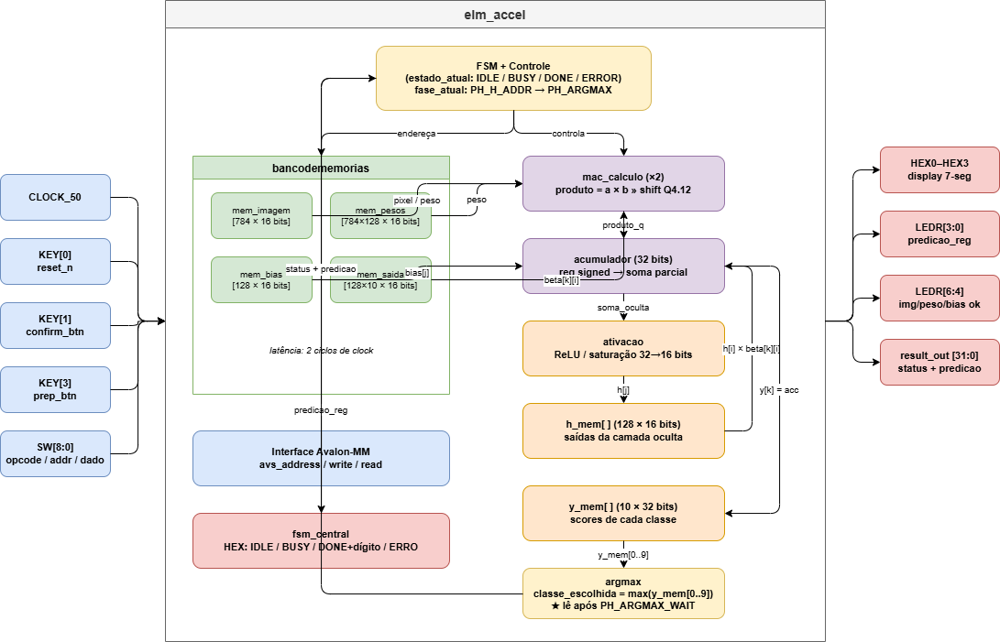
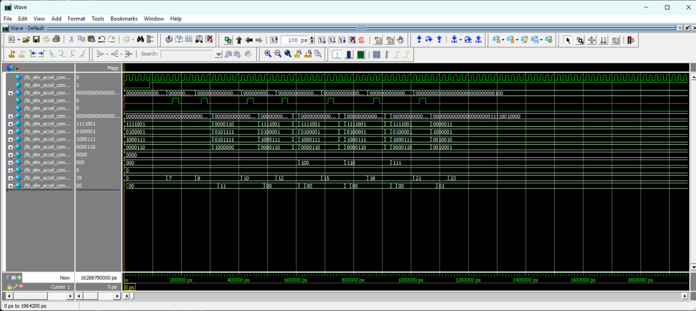

# 🧠 Coprocessador ELM — TEC 499 MI Sistemas Digitais 2026.1

> **Marco 1 — Coprocessador ELM em FPGA + Simulação**
> Universidade Estadual de Feira de Santana · Departamento de Tecnologia

---

## 📋 Sumário

1. [Sobre o Projeto](#1-sobre-o-projeto)
2. [Requisitos](#2-requisitos)
3. [Arquitetura e Funcionamento](#3-arquitetura-e-funcionamento)
4. [Formato Numérico Q4.12](#4-formato-numérico-q412)
5. [Módulos do Hardware](#5-módulos-do-hardware)
6. [Conjunto de Instruções (ISA)](#6-conjunto-de-instruções-isa)
7. [Ambiente e Ferramentas](#7-ambiente-e-ferramentas)
8. [Como Executar](#8-como-executar)
9. [Como Desenvolvemos](#9-como-desenvolvemos)
10. [Testes e Simulação](#10-testes-e-simulação)
11. [Usando na Placa](#11-usando-na-placa)
12. [Resultados](#12-resultados)
13. [Organização do Repositório](#13-organização-do-repositório)
14. [Referências](#14-referências)

---

## 1. Sobre o Projeto

Este repositório contém a implementação RTL em **Verilog** de um coprocessador dedicado à inferência de dígitos manuscritos (0–9) utilizando uma **Extreme Learning Machine (ELM)** sobre a plataforma **DE1-SoC** (Intel Cyclone V SoC).

O trabalho foi desenvolvido em grupo por:

- **Matheus Rodrigues**
- **Adna Amorim**
- **Allen Júnior**

A proposta foi construir, em hardware descrito em Verilog, uma rede neural MLP capaz de classificar dígitos manuscritos diretamente na FPGA, sem auxílio de processador. O sistema recebe uma imagem 28×28 pixels do dataset MNIST, processa as duas camadas da rede e retorna o dígito previsto nos displays e LEDs da placa **DE1-SoC**.

---

### 1.1 Entrada de Dados

- **Tamanho:** 784 pixels (matriz 28×28)
- **Formato:** Q4.12, 16 bits por pixel (WIDTH=16)
- **Binarização:** pixels com valor ≥ 1536 em Q4.12 (≈ 0.375) são mapeados para 4095; demais para 0

---

### 1.2 Camada Oculta

$$h = \sigma(W \cdot x + b)$$

- $W$: Matriz de pesos 784×128, armazenada em BRAM
- $x$: Pixel binarizado em Q4.12
- $b$: Vetor de bias com 128 neurônios
- $\sigma$: Sigmoid aproximada por interpolação linear por partes (4 segmentos)

---

### 1.3 Camada de Saída

$$y = \beta \cdot h$$

- $\beta$: Matriz de pesos de saída 128×10, obtida no pré-treino e armazenada em ROM

---

### 1.4 Predição Final

$$\text{pred} = \text{argmax}(y)$$

O sistema retorna um valor no intervalo **0..9** indicando o dígito identificado, exibido nos displays HEX e nos LEDs da placa.

---

**Parâmetros do modelo:**

| Parâmetro | Dimensão | Memória |
|-----------|----------|---------|
| W (pesos oculta) | 784 × 128 | ~200 KB (Q4.12) |
| b (bias oculta) | 128 × 1 | 256 B |
| β (pesos saída) | 128 × 10 | ~2,5 KB (Q4.12) |

### 1.5 Como a inferência funciona no hardware

A inferência é feita de forma sequencial — um neurônio de cada vez. Para cada um dos 128 neurônios ocultos, a FSM percorre todos os 784 pixels, acumulando o produto `pixel × peso` em um registrador de 32 bits. Ao terminar, soma o bias, passa pelo módulo de ativação (sigmoid aproximada) e salva o resultado em `h_mem`. Só depois de calcular todos os 128 neurônios ocultos é que começa a camada de saída, que faz o mesmo processo para as 10 classes.

O ponto crítico é a latência das BRAMs: as memórias síncronas do Quartus levam 1 ciclo para entregar o dado após o endereço ser apresentado. Por isso cada iteração do MAC tem 2 ciclos de espera embutidos na FSM (`PH_H_WAIT0` e `PH_H_WAIT1`). Sem eles, o multiplicador receberia o dado do endereço anterior e o acumulador ficaria errado do primeiro pixel em diante.

No total, a inferência completa leva cerca de **101.770 ciclos**, o que a 50 MHz representa **~2 ms** — tempo mais que suficiente para a aplicação de classificação de dígitos em tempo real.

---

## 2. Requisitos

### 2.1 Funcionais

| ID | Requisito |
|----|-----------|
| RF-01 | Aceitar imagem 28×28 pixels em formato Q4.12 (WIDTH=16) |
| RF-02 | Implementar camada oculta: `h = sigmoid(W · x + b)` com 128 neurônios |
| RF-03 | Implementar camada de saída: `y = β · h` com 10 classes |
| RF-04 | Retornar predição `pred = argmax(y)` no intervalo [0, 9] |
| RF-05 | Todos os valores internos em ponto fixo Q4.12 |
| RF-06 | Arquitetura sequencial com FSM de controle |
| RF-07 | Datapath com unidade MAC (Multiply-Accumulate) |
| RF-08 | Função de ativação sigmoid aproximada por interpolação linear |
| RF-09 | Memórias para imagem, pesos W, bias b e pesos β |
| RF-10 | ISA com instruções: STORE_IMG, STORE_W, STORE_B, START, STATUS, CLEAR_ERR |
| RF-11 | Interface Avalon-MM para integração futura com processador |
| RF-12 | Inicialização automática via módulo `inicializador.v` ao sair do reset |

### 2.2 Não-funcionais

| ID | Requisito |
|----|-----------|
| RNF-01 | Sintetizável para DE1-SoC (Cyclone V — 5CSEMA5F31C6) |
| RNF-02 | Clock alvo: 50 MHz |
| RNF-03 | Testbench com 11 cenários cobrindo todos os estados da FSM |
| RNF-04 | Código Verilog comentado e documentado por módulo |
| RNF-05 | Script Python para conversão de imagens PNG → MIF em Q4.12 |

### 2.3 Restrições de projeto

- Representação exclusiva em ponto fixo Q4.12 (sem ponto flutuante)
- Pesos residem em blocos BRAM/ROM inicializados via arquivos `.mif`
- Arquitetura estritamente sequencial (sem paralelismo entre camadas)
- Imagens de entrada obrigatoriamente em WIDTH=16 (Q4.12) — arquivos WIDTH=8 não são compatíveis com o hardware

---

## 3. Arquitetura e Funcionamento

### 3.1 Diagrama de blocos



---

### 3.2 Fluxo da inferência


O fluxo completo em alto nível:

```
Imagem (784px, Q4.12) → Binarização → Camada oculta (128×) → Camada de saída (10×) → Argmax → Predição (0–9)
```

---

### 3.3 Máquina de estados

Quatro estados principais controlam todo o fluxo do sistema:

| Estado | Descrição |
|--------|-----------|
| `IDLE` | Aguardando comando. Aceita STORE e START |
| `BUSY` | Executando STORE (1 ciclo) ou inferência completa (15 fases) |
| `DONE` | Inferência concluída. Resultado disponível nos LEDs e displays |
| `ERROR` | CMD_START disparado sem as 3 flags ativas |

Transições principais: `reset → IDLE` · `CMD_START (flags ok) → BUSY` · `inferência concluída → DONE` · `CMD_CLEAR_ERR → IDLE`

---

### 3.4 Fases internas do BUSY

As fases existem porque as BRAMs síncronas têm latência de 1 ciclo — sem os estados de espera, o dado lido não estaria disponível no ciclo do MAC.

| Fase | Nome | Descrição |
|------|------|-----------|
| 0 | `PH_H_ADDR` | Aponta endereços da imagem e do peso |
| 1–2 | `PH_H_WAIT0/1` | Aguarda latência da BRAM (2 ciclos) |
| 3 | `PH_H_MAC` | Acumula pixel × peso |
| 4 | `PH_H_BIAS` | Aponta endereço do bias |
| 5–6 | `PH_H_BIAS_W0/1` | Aguarda latência do bias |
| 7 | `PH_H_ACT` | Aplica sigmoid |
| 8 | `PH_H_SAVE` | Salva resultado em h_mem |
| 9 | `PH_O_ADDR` | Aponta endereço do beta |
| 10–11 | `PH_O_WAIT0/1` | Aguarda latência da BRAM |
| 12 | `PH_O_MAC` | Acumula h × beta |
| 13 | `PH_ARGMAX_WAIT` | Aguarda propagação de y_mem[9] |
| 14 | `PH_ARGMAX` | Lê argmax e vai para DONE |

---

## 4. Formato Numérico Q4.12

Todos os valores internos utilizam ponto fixo **Q4.12** (signed, 16 bits):

```
  Bit 15   │  Bits 14–12  │  Bits 11–0
  ─────────┼──────────────┼────────────
  Sinal    │  Parte int.  │  Parte frac.
  (1 bit)  │   (3 bits)   │  (12 bits)
```

- **Resolução:** `1/4096 ≈ 0.000244`
- **Faixa:** `[-8.0, +7.999...]`
- **"1.0":** `0x1000` = 4096
- **Conversão:** `valor_real = valor_inteiro / 4096`

Usar ponto fixo foi uma decisão fundamental: elimina divisores e unidades de ponto flutuante do hardware, reduz área e aumenta frequência máxima de operação, sem perda de precisão relevante para a classificação.

### Saturação no datapath

O acumulador usa 32 bits para evitar overflow durante a soma dos 784 produtos. O resultado é saturado antes de entrar na ativação:

```verilog
if (valor > 32'sd32767)    saida = 16'sd32767;
else if (valor < -32'sd32768) saida = -16'sd32768;
else saida = valor[15:0];
```

### Conversão de imagens PNG → Q4.12

```python
valor_q12 = round(pixel_uint8 * 4096 / 255)
```

> ⚠️ **Atenção:** imagens geradas com `WIDTH=8` (uint8 bruto, valores 0–255) **não funcionam** com este hardware. O limiar de binarização é 1536 em Q4.12 — valores uint8 nunca o atingem, e a rede recebe uma imagem completamente preta.

---

## 5. Módulos do Hardware

| Arquivo | Módulo | Função |
|:--------|:-------|:-------|
| `coprocessador.v` | `coprocessador` | Top-level da placa; conecta periféricos físicos ao acelerador |
| `elm_accel.v` | `elm_accel` | Núcleo principal; FSM + datapath + controle + Avalon |
| `inicializador.v` | `inicializador` | FSM de inicialização automática via Avalon-MM |
| `bancodememorias.v` | `bancodememorias` | Agrupa as 4 memórias com mux de prioridade escrita/leitura |
| `mac_calculo.v` | `mac_calculo` | Multiplicador Q4.12 com reescala por shift aritmético |
| `ativacao.v` | `ativacao` | Sigmoid aproximada por 4 segmentos lineares |
| `argmax.v` | `argmax` | Varredura dos 10 acumuladores; retorna índice do maior |
| `fsm_central.v` | `fsm_central` | Controlador dos displays HEX |
| `mem_imagem.v` | `mem_imagem` | BRAM 784×16b — pixels da imagem |
| `mem_pesos.v` | `mem_pesos` | BRAM 100.352×16b — pesos W da camada oculta |
| `mem_bias.v` | `mem_bias` | BRAM 128×16b — bias da camada oculta |
| `mem_saida.v` | `mem_saida` | ROM 1.280×16b — pesos β da camada de saída |

---

### 5.1 `elm_accel.v`

É o módulo mais importante do projeto — onde ficou a maior parte do trabalho. Integra todos os submódulos e gerencia o fluxo completo da inferência. Contém:

- detector de borda dos botões (`confirma_pulso`, `prepara_pulso`)
- FSM principal com 4 estados e 15 fases internas
- controle de escrita nas memórias via STORE
- datapath: acumulador 32b, `h_mem[128]`, `y_mem[10]`
- montagem da palavra de status de 32 bits
- interface Avalon-MM para integração futura com processador

**Palavra de status `result_out[31:0]`:**

| Bits | Campo | Descrição |
|------|-------|-----------|
| `[3:0]` | predicao | Dígito previsto (0–9) |
| `[4]` | busy | 1 em ST_BUSY |
| `[5]` | done | 1 em ST_DONE |
| `[6]` | error | 1 em ST_ERROR |
| `[7]` | bias_ok | Flag de bias carregado |
| `[8]` | pesos_ok | Flag de pesos carregados |
| `[9]` | imagem_ok | Flag de imagem carregada |
| `[11:10]` | estado | 00=IDLE 01=BUSY 10=DONE 11=ERROR |

---

### 5.2 `bancodememorias.v`

Gerencia o chaveamento entre leitura (inferência) e escrita (STORE). Quando `escreve_*` está ativo, o endereço de escrita tem prioridade sobre o de leitura:

```verilog
endereco_final = escreve ? endereco_escrita : endereco_leitura;
```

| Instância | Módulo | Tamanho | Conteúdo |
|-----------|--------|---------|----------|
| `bloco_imagem` | `mem_imagem` | 784 × 16b | Pixels da entrada em Q4.12 |
| `bloco_pesos` | `mem_pesos` | 100.352 × 16b | Pesos W[784][128] da camada oculta |
| `bloco_bias` | `mem_bias` | 128 × 16b | Bias b[128] da camada oculta |
| `bloco_beta` | `mem_saida` | 1.280 × 16b | Pesos β[128][10] — ROM somente leitura |

---

### 5.3 `mac_calculo.v`

Núcleo aritmético reutilizado nas duas camadas. Multiplica dois operandos signed de 16 bits e reescala o resultado:

```
product_full   = a × b               (32 bits, Q8.24)
product_scaled = product_full >>> 12 (32 bits, Q4.12)
```

O shift aritmético de 12 bits remove os bits fracionários extras da multiplicação, devolvendo o resultado no formato Q4.12 original. É puramente combinacional — sem clock nem estado.

---

### 5.4 `ativacao.v`

A sigmoid real `σ(x) = 1/(1+e^-x)` exige exponencial e divisão — inviável em hardware. A solução foi aproximar com 4 segmentos de reta entre x=−4 e x=+4:

```
saida = base_y + ((entrada − base_x) × inclinação) >>> 12
```

| Segmento | X inicial | X final | Inclinação Q4.12 |
|----------|-----------|---------|------------------|
| 01 | −4 | −2 | 207 |
| 12 | −2 | 0 | 780 |
| 23 | 0 | +2 | 780 |
| 34 | +2 | +4 | 206 |

Fora da faixa [−4, +4] satura em 0 ou 4095. Erro máximo < 2% em relação à sigmoid exata. Módulo puramente combinacional.

---

### 5.5 `argmax.v`

Varredura linear dos 10 acumuladores `y_mem[0..9]`. Começa assumindo classe 0 como vencedora e atualiza ao encontrar valor maior. Em empate, a classe de menor índice vence (comparação estrita `>`). Puramente combinacional.

---

### 5.6 `fsm_central.v`

Decodifica os flags da palavra de status e exibe nos 4 displays HEX. Prioridade: ERRO > BUSY > DON? > IDLE.

| Estado | HEX3 | HEX2 | HEX1 | HEX0 |
|--------|------|------|------|------|
| ERROR | E | R | R | O |
| BUSY | B | U | S | Y |
| DONE | D | O | N | 0–9 |
| IDLE | I | D | L | E |

---

### 5.7 `inicializador.v`

Ao sair do reset, envia via Avalon-MM a sequência completa de instruções sem interação manual:

```
ST_STORE_IMG → ST_STORE_W → ST_STORE_B → ST_START → ST_WAIT_DONE
```

Aguarda `ST_DONE` lendo o registrador de status (endereço `0x3`). Desenvolvido para a apresentação — permite demonstrar o fluxo completo de instruções automaticamente.

---

## 6. Conjunto de Instruções (ISA)

### 6.1 Formato da instrução

```
  SW[8:6]       SW[5:3]       SW[2:0]
 ┌────────────┬────────────┬────────────┐
 │   DADO     │  ENDEREÇO  │   OPCODE   │
 │  (3 bits)  │  (3 bits)  │  (3 bits)  │
 └────────────┴────────────┴────────────┘
```

Total: **9 bits**, permitindo 8 opcodes possíveis. 6 estão definidos; `110` e `111` caem no `default` da FSM.

### 6.2 Opcodes disponíveis

| Opcode | Binário | Instrução | Função |
|--------|---------|-----------|--------|
| 0 | `000` | `CLEAR_ERR` | Limpa estado de erro → IDLE |
| 1 | `001` | `STORE_IMG` | Sinaliza imagem pronta (`imagem_ok = 1`) |
| 2 | `010` | `STORE_W` | Sinaliza pesos prontos (`pesos_ok = 1`) |
| 3 | `011` | `STORE_B` | Sinaliza bias pronto (`bias_ok = 1`) |
| 4 | `100` | `START` | Inicia inferência (exige as 3 flags ativas) |
| 5 | `101` | `STATUS` | Mantém estado atual (leitura de status) |

### 6.3 Interface Avalon-MM

**Escrita (carga de dados):**

| Endereço | Operação |
|----------|----------|
| `0x0` | Grava pixel: `[25:16]` = endereço, `[15:0]` = valor Q4.12 |
| `0x1` | Grava peso: `[28:12]` = endereço, `[15:0]` = valor Q4.12 |
| `0x2` | Grava bias: `[22:16]` = endereço, `[15:0]` = valor Q4.12 |

**Leitura (status e resultado):**

| Endereço | Conteúdo |
|----------|----------|
| `0x3` | Palavra de status completa (32 bits) |
| `0x4` | Predição final `[3:0]` |
| `0x5` | Ciclos totais de execução |

### 6.4 Comportamento do STORE

**Com `.mif` (uso normal):** dados já carregados desde a síntese. Os STORE servem apenas para levantar as flags internas, sem regravar nada.

**Com escrita manual (teste/depuração):**
1. `KEY[3]` prepara o valor (opcode + endereço + dado nos switches)
2. `KEY[1]` confirma e grava

> Apertar apenas `KEY[3]` **não** grava. Apertar `KEY[1]` sem preparação também **não** grava.

### 6.5 Por que escolhemos o Avalon-MM

A interface Avalon-MM é o protocolo padrão do ecossistema Intel/Quartus para comunicação entre componentes em sistemas FPGA. Escolhemos ela por três razões práticas:

**Integração futura com o HPS:** a DE1-SoC tem um processador ARM (HPS) que se comunica com a FPGA via barramento Avalon. Ao implementar a interface desde agora, o acelerador já nasce preparado para ser controlado por software nos próximos marcos — sem precisar refazer a lógica de controle.

**Simplicidade do protocolo:** Avalon-MM é mapeado em memória — o mestre escreve em um endereço e o escravo responde. Não há handshake complexo. No nosso caso `avs_waitrequest` é sempre `0`, o que significa que toda transação completa em 1 ciclo. É direto ao ponto.

**Reutilização no inicializador:** o módulo `inicializador.v` atua como mestre Avalon e envia as instruções automaticamente ao sair do reset. Sem a interface padronizada, teríamos que criar um protocolo proprietário entre os dois módulos — e o Avalon já resolve isso com 6 fios.

---

## 7. Ambiente e Ferramentas

### 7.1 Hardware utilizado

| Item | Especificação |
|------|--------------|
| Placa FPGA | Terasic DE1-SoC |
| FPGA | Intel Cyclone V SoC — 5CSEMA5F31C6 |
| Clock FPGA | 50 MHz (onboard) |
| Cabo | USB Blaster |

### 7.2 Software utilizado

| Ferramenta | Versão | Uso |
|------------|--------|-----|
| Quartus Prime Lite | 25.1 | Síntese, place & route, programação |
| ModelSim-Intel | 2020.1 | Simulação RTL e testbench |
| Python 3 + Pillow | 3.x | Conversão de imagens PNG → MIF em Q4.12 |
| Git | 2.x | Controle de versão |

### 7.3 Mapeamento de pinos

| Pino | Sinal | Função |
|------|-------|--------|
| `CLOCK_50` | `clk` | Clock principal 50 MHz |
| `KEY[0]` | `reset_n` | Reset ativo em nível baixo |
| `KEY[1]` | `confirm_btn` | Confirma comando (ativo baixo) |
| `KEY[3]` | `prep_btn` | Prepara dado para STORE (ativo baixo) |
| `SW[2:0]` | `opcode_cmd` | Opcode do comando |
| `SW[5:3]` | `endereco_teste` | Endereço do dado de teste |
| `SW[8:6]` | `dado_teste` | Valor do dado de teste |
| `LEDR[3:0]` | `ledr_pred` | Predição final em binário (0–9) |
| `LEDR[6:4]` | `ledr_flags` | `[6]`=img_ok `[5]`=peso_ok `[4]`=bias_ok |
| `LEDR[9:7]` | — | Sempre apagados |
| `HEX0` | `hex0` | Dígito previsto |
| `HEX1–HEX3` | `hex1–hex3` | Status do sistema |

---

## 8. Como Executar

### 8.1 Dependências

```bash
# Instalar Python e Pillow
python -m pip install pillow
```

> Para síntese e programação: **Intel Quartus Prime Lite 25.1**, disponível em [intel.com](https://www.intel.com/content/www/us/en/software/programmable/quartus-prime/download.html)

### 8.2 Clonar

```bash
git clone https://github.com/<seu-usuario>/<seu-repositorio>.git
cd <seu-repositorio>
```

### 8.3 Converter imagens PNG para MIF

Os scripts ficam na pasta `Imagens/`:

```bash
# Uma imagem só
python create_img.py arquivo "Imagens para teste/32.png" imagem_32.mif

# Pasta inteira → salva em Imagens/mifs/ (mantém estrutura de subpastas)
python create_img.py pasta "Imagens para teste/" mifs/
```

### 8.4 Compilar no Quartus

```
1. File → Open Project → pbl.qpf
2. Garantir que W_in_q.mif, beta_q.mif e b_q.mif estão na pasta do projeto
3. Para trocar a imagem: abrir mem_imagem pelo Quartus e selecionar o novo .mif
4. Processing → Start Compilation
```

### 8.5 Gravar na placa

```
1. Tools → Programmer
2. Selecionar pbl.sof
3. Start
```

### 8.6 Simular

```
1. Compile → Compile All (incluindo tb_elm_accel_completo.v)
2. Simulate → Start Simulation → tb_elm_accel_completo
3. No console: run -all
```

> Para trocar a imagem na simulação, converter o `.mif` para `.hex` e usar `mem_imagem_sim.v`:
> ```bash
> python mif_para_hex.py sua_imagem.mif imagem.hex
> ```
> O ModelSim não recarrega `init_file` da altsyncram de forma confiável — o `mem_imagem_sim.v` substituto usa `$readmemh` para contornar isso.

---

## 9. Como Desenvolvemos

### 9.1 Fase 1 — Entendimento do problema e arquitetura

O ponto de partida foi estudar a matemática da ELM: produto matricial da camada oculta, ativação sigmoid e produto matricial da camada de saída. Antes de escrever qualquer linha de Verilog, elaboramos diagramas de fluxo detalhando cada etapa — o que permitiu mapear quais operações seriam necessárias, quais dados precisariam ser armazenados e em que ordem cada resultado dependia do anterior.

A decisão mais importante dessa fase foi usar **ponto fixo Q4.12** para toda a aritmética interna. Isso simplificou bastante o hardware sem perda de precisão relevante para a classificação.

### 9.2 Fase 2 — Implementação bottom-up dos módulos

Cada módulo foi escrito e validado individualmente antes de ser integrado. A ordem foi:

1. `mac_calculo.v` — aritmética Q4.12 e reescala por shift
2. `ativacao.v` — os 4 segmentos lineares da sigmoid
3. `argmax.v` — comparação dos 10 acumuladores
4. `bancodememorias.v` — mux de prioridade escrita/leitura
5. `fsm_central.v` — decodificador dos displays
6. `elm_accel.v` — FSM principal com as 15 fases

### 9.3 Fase 3 — Sincronização com latência da BRAM

A principal dificuldade técnica foi a **latência de 1 ciclo das BRAMs síncronas**. Ao apresentar um endereço no ciclo N, o dado só está disponível no ciclo N+1. Sem os estados de espera `PH_H_WAIT0` e `PH_H_WAIT1`, o MAC operaria com o dado do endereço anterior, corrompendo toda a inferência.

A depuração foi feita ciclo a ciclo no ModelSim, comparando os valores intermediários de `h_mem` e `y_mem` com cálculos manuais em Q4.12.

### 9.4 Fase 4 — Bug das imagens de entrada

Durante os testes, descobrimos que imagens geradas com o script original do professor (`WIDTH=8`, valores 0–255) resultavam em predição sempre errada — a rede enxergava uma imagem completamente preta. A causa foi o limiar de binarização: `IMG_BIN_TH = 1536` em Q4.12 nunca é atingido por valores uint8 (máximo 255).

A correção foi ajustar o `create_img.py` para escalar os pixels para Q4.12:

```python
valor_q12 = round(pixel_uint8 * 4096 / 255)
```

Esse foi um dos bugs mais difíceis de identificar — a compilação passava sem erros, a simulação rodava normalmente, e só a predição saía errada.

### 9.5 Fase 5 — Inicializador automático e testes finais

Com a inferência validada por simulação, desenvolvemos o `inicializador.v` para automatizar o envio das instruções via Avalon-MM ao sair do reset, eliminando a interação manual com os switches durante a apresentação.

Os testes finais na placa confirmaram que o comportamento observado em simulação foi preservado no hardware real, com a predição correta exibida nos displays e LEDs.

---

## 10. Testes e Simulação

### 10.1 Estratégia

A verificação foi realizada em dois níveis: simulação funcional no ModelSim com o testbench `tb_elm_accel_completo.v`, cobrindo 11 cenários distintos, e validação física na placa DE1-SoC com imagens reais do dataset MNIST.

### 10.2 Casos de teste

| Caso | Descrição | Resultado |
|------|-----------|-----------|
| TC-01 | Reset e estado inicial (todas as flags zeradas) | ✅ Passou |
| TC-02 | CMD_STATUS sem dados — permanece em IDLE | ✅ Passou |
| TC-03 | CMD_START sem dados → ST_ERROR | ✅ Passou |
| TC-04 | CMD_CLEAR_ERR → ST_IDLE, flag de erro limpa | ✅ Passou |
| TC-05 | CMD_STORE_IMG via botão → `imagem_ok=1` | ✅ Passou |
| TC-06 | CMD_STORE_W via botão → `pesos_ok=1` | ✅ Passou |
| TC-07 | CMD_STORE_B via botão → `bias_ok=1` | ✅ Passou |
| TC-08 | CMD_START com dados → ST_BUSY → ST_DONE → predição válida | ✅ Passou |
| TC-09 | Re-inferência a partir de ST_DONE | ✅ Passou |
| TC-10 | CMD_CLEAR_ERR de ST_DONE → ST_IDLE com flags preservadas | ✅ Passou |
| TC-11 | Reset + CMD_START imediato → ST_ERROR | ✅ Passou |

**Resultado final: 35 PASS / 0 FAIL**

### 10.3 Formas de onda



### 10.4 Executar

```bash
vsim -c tb_elm_accel_completo -do "run -all"
```

### 10.5 Problema com init_file no ModelSim

O ModelSim não recarrega o `init_file` da altsyncram de forma confiável ao trocar o `.mif`. Para contornar isso, use `mem_imagem_sim.v` no lugar de `mem_imagem.v` **apenas na simulação**:

```bash
# Converte .mif para .hex
python mif_para_hex.py imagem.mif imagem.hex
```

O `mem_imagem_sim.v` usa `$readmemh("imagem.hex", mem)` na inicialização, carregando corretamente a imagem desejada.

---

## 11. Usando na Placa

### 11.1 Fluxo automático

Com o `inicializador.v` instanciado no `coprocessador.v`, basta soltar o reset (`KEY[0]`) — o sistema envia automaticamente todas as instruções e inicia a inferência. O display mostrará:

```
IDLE → BUSY → DON[dígito]
```

### 11.2 Fluxo manual

```
1. KEY[0]              → Reset
2. SW[2:0]=001 + KEY[1] → STORE_IMG  (LEDR[6] acende)
3. SW[2:0]=010 + KEY[1] → STORE_W   (LEDR[5] acende)
4. SW[2:0]=011 + KEY[1] → STORE_B   (LEDR[4] acende)
5. SW[2:0]=100 + KEY[1] → START     (display: BUSY → DON?)
```

### 11.3 Limpar um erro

```
SW[2:0]=000 + KEY[1]  →  CLEAR_ERR  →  display volta para IDLE
```

### 11.4 Significado dos LEDs

| LED | Significado |
|-----|-------------|
| `LEDR[6]` | Imagem confirmada (`imagem_ok`) |
| `LEDR[5]` | Pesos confirmados (`pesos_ok`) |
| `LEDR[4]` | Bias confirmado (`bias_ok`) |
| `LEDR[3:0]` | Dígito previsto em binário (ex: `0111` = 7) |

---

## 12. Resultados

### 12.1 Uso de recursos na FPGA

Dados obtidos após síntese e fitting no Quartus Prime 25.1 para **Cyclone V — 5CSEMA5F31C6**:

| Recurso | Usado | Disponível | % |
|---------|-------|------------|---|
| ALMs (lógica combinacional) | 1.921 | 32.070 | 6% |
| ALUTs combinacionais | 2.373 | — | — |
| Registradores (flip-flops) | 2.438 | 128.280 | ~2% |
| Blocos M10K (BRAM) | 203 | 397 | 51% |
| Bits de memória total | 1.640.704 | 4.065.280 | 40% |
| Blocos DSP (18×18) | 4 | 87 | 5% |
| Pinos | 53 | 457 | 12% |

O consumo de ALMs é baixo (6%) — a maior parte da área vai para as memórias. Os 4 blocos DSP correspondem às duas unidades MAC instanciadas (cada multiplicador 16×16 signed usa 2 blocos DSP). Os 51% de M10K vêm quase inteiramente da `mem_pesos` (100.352 palavras × 16 bits = ~1,6 Mbits).

Distribuição dos ALUTs por módulo (dados do relatório de mapeamento):

| Módulo | ALUTs combinacionais | Flip-flops |
|--------|---------------------|------------|
| `elm_accel` (FSM + datapath) | 976 | 2.056 |
| `argmax` | 807 | 0 |
| `ativacao` | 41 | 0 |
| `inicializador` + `coprocessador` | ~549 | ~382 |

O `argmax` consome 807 ALUTs porque compara 10 valores de 32 bits em lógica puramente combinacional — é o módulo mais custoso em área combinacional depois da FSM principal.

### 12.2 Latência de inferência

| Etapa | Ciclos |
|-------|--------|
| Camada oculta (784 × 128 MACs) | ~100.352 |
| Ativação sigmoid (128 neurônios) | 128 |
| Camada de saída (128 × 10 MACs) | ~1.280 |
| Argmax + overhead | ~10 |
| **Total** | **~101.770 ciclos** |
| **Latência @ 50 MHz** | **~2,03 ms por inferência** |

O bottleneck é a camada oculta: 784 pixels × 128 neurônios = 100.352 iterações do loop MAC, cada uma levando 4 ciclos (ADDR + WAIT0 + WAIT1 + MAC). A arquitetura é sequencial por escolha — paralelizar reduziria a latência mas aumentaria muito o uso de DSPs e ALMs.

### 12.3 Dificuldades encontradas

**Latência da BRAM**

As memórias síncronas têm 1 ciclo de latência entre endereço e dado. Sem compensação, o MAC operaria com dados do ciclo anterior. Solução: adicionar 2 estados de espera (`PH_H_WAIT0`, `PH_H_WAIT1`) na FSM antes de cada operação de multiplicação.

**Imagens em formato errado**

O script original do professor gerava WIDTH=8 (uint8 bruto). O limiar de binarização do hardware é 1536 em Q4.12 — inalcançável por valores 0–255. A inferência resultava em imagem preta para a rede. Solução: corrigir o `create_img.py` para escalar com `round(pixel * 4096 / 255)`.

**ModelSim não carrega MIF via init_file**

O ModelSim às vezes ignora completamente o `init_file` da altsyncram. Solução: módulo substituto `mem_imagem_sim.v` que usa `$readmemh` para carregar um arquivo `.hex`, contornando a limitação.

### 12.4 Observações

A sigmoid piecewise linear com 4 segmentos mantém erro < 2% em relação à sigmoid exata, suficiente para a classificação de dígitos. Os testes na placa confirmaram que o comportamento observado em simulação foi preservado no hardware real.

---

## 13. Organização do Repositório

```
PBLFinal/
├── README.md
│
├── Arquivos PBL/                      ← Projeto Quartus completo
│   ├── argmax.v                       ← Seleção da classe de maior score
│   ├── ativacao.v                     ← Sigmoid aproximada por partes
│   ├── bancodememorias.v              ← Banco de memórias com mux
│   ├── b_q.mif                        ← Bias da camada oculta (Q4.12)
│   ├── beta_q.mif                     ← Pesos β da camada de saída (Q4.12)
│   ├── coprocessador.v                ← Top-level da placa
│   ├── elm_accel.v                    ← Núcleo principal (FSM + datapath)
│   ├── fsm_central.v                  ← Controlador dos displays HEX
│   ├── inicializador.v                ← FSM de inicialização automática
│   ├── mac_calculo.v                  ← Multiplicador Q4.12
│   ├── mem_bias.v                     ← BRAM 128×16b
│   ├── mem_imagem.v                   ← BRAM 784×16b
│   ├── mem_pesos.v                    ← BRAM 100352×16b
│   ├── mem_saida.v                    ← ROM 1280×16b
│   ├── W_in_q.mif                     ← Pesos W da camada oculta (Q4.12)
│   ├── simulation/                    ← Arquivos de simulação ModelSim
│   ├── output_files/                  ← Bitstream e relatórios de síntese
│   └── ...                            ← Arquivos internos do Quartus
│
├── docs/
│   ├── diagrama_drawio.png            ← Diagrama interno do elm_accel
│   ├── diagrama_de_fluxo_drawio.png   ← Fluxo de entradas e saídas
│   └── simulacao_modelsim.png         ← Captura das formas de onda
│
├── Imagens/
│   ├── Imagens para teste/            ← PNGs originais 28×28 para teste
│   └── mifs/                          ← Imagens convertidas para Q4.12
│
├── Peso, bias, beta/                  ← Arquivos de pesos do modelo treinado
│
└── Simulações/
    ├── tb_elm_accel_completo.v        ← Testbench (11 testes, 35 PASS/0 FAIL)
    ├── mem_imagem_sim.v               ← Substituto da mem_imagem para simulação
    ├── Memoria_tb.jpg                 ← Captura do banco de memórias simulado
    ├── simulacao                      ← Log da simulação
    └── wave.do                        ← Script de configuração das formas de onda
```

---

## 14. Referências

1. **DE1-SoC User Manual** — Terasic Technologies. Disponível em: [fpgacademy.org](https://fpgacademy.org/boards.html)
2. **Accelerating Extreme Learning Machine on FPGA** — UTHM Publisher. Disponível em: [publisher.uthm.edu.my](https://publisher.uthm.edu.my/ojs/index.php/ijie/article/view/4431)
3. **Extreme learning machine: algorithm, theory and applications** — ResearchGate. Disponível em: [researchgate.net](https://www.researchgate.net/publication/257512921)
4. **Intel Quartus Prime Lite Design Software** — versão 25.1.
5. **ChatGPT** — OpenAI. Assistente de linguagem utilizado como apoio no desenvolvimento e documentação do projeto. Disponível em: [openai.com/chatgpt](https://openai.com/chatgpt)
6. **Claude** — Anthropic. Assistente de linguagem utilizado como apoio no desenvolvimento e documentação do projeto. Disponível em: [claude.ai](https://claude.ai)

---

<div align="center">

*Universidade Estadual de Feira de Santana — UEFS · Departamento de Tecnologia · TEC 499 MI Sistemas Digitais 2026.1*

</div>
